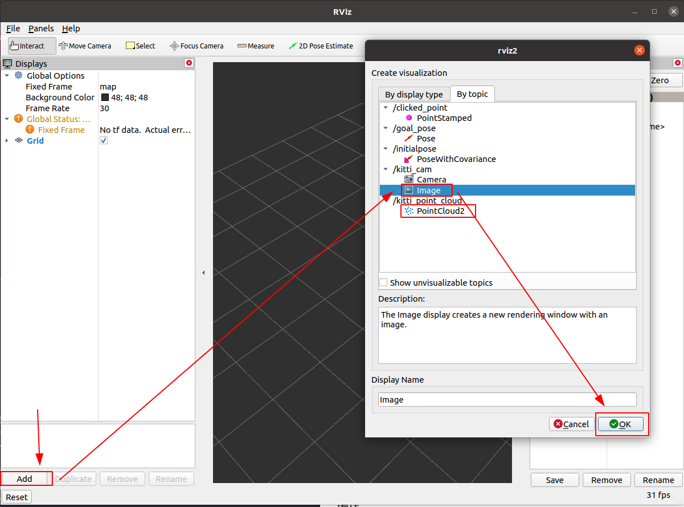

## 项目介绍

使用Ros2对KITTI数据集进行可视化

## 安装与使用

#### 环境介绍

- Ubuntu20.04 + python3.8

#### 数据集

- 根据[kitti2bag仓库](https://github.com/tomas789/kitti2bag)下载kitti raw文件和calib文件，组织文件格式如下：

```
kitti_raw_data
├── 2011_09_26
│   ├── 2011_09_26_drive_0005_sync
│   │   ├── image_00
│   │   ├── image_01
│   │   ├── image_02
│   │   ├── image_03
│   │   ├── oxts
│   │   └── velodyne_points
│   ├── calib_cam_to_cam.txt
│   ├── calib_imu_to_velo.txt
│   └── calib_velo_to_cam.txt
├── 2011_09_26_calib.zip
└── 2011_09_26_drive_0005_sync.zip
```

#### 安装ros2 foxy

- 安装方式看参考文献 “ROS2 FOY 官网“、“小鱼ROS2 FOXY 教学”

#### 克隆项目

```bash
git clone https://github.com/daxiongpro/my_ros_kitti.git
cd my_ros_kitti
```

#### 安装相应的环境

```bash
conda deactivate # 选择python基环境
pip install -r requirements.txt # requirements.txt 尚未填写
```

#### 修改代码中的dataset根目录

- 打开`src/kitti_tutorial/kitti_tutorial/kitti.py`
- 修改变量名`DATASET_PATH`为你自己的目录

#### 编译

```bash
# source以下ros的环境，如果不想每次都source，可以加入.bashrc或者.zshrc的环境变量中
source /opt/ros/foxy/setup.bash # source /opt/ros/foxy/setup.zsh # 如果你电脑装了zsh
# 编译
colcon build
```

#### 发布

```bash
# 保证在工作空间下，即clone下来的根目录
source install/setup.bash # source install/setup.zsh 
ros2 run kitti_tutorial kitti_node
```

#### RVIZ2进行显示

- 终端中打开rviz2

```bash
rviz2
```

- 在rviz2中依次点击 "ADD" -> "By topic" -> “{{ 你想要加入的topic}}”



## 参考文献

[ROS2 FOY 官网](https://docs.ros.org/en/foxy/)

[小鱼ROS2 FOXY 教学](https://github.com/fishros/d2l-ros2-foxy)

[ROS1 KITTY 代码](https://github.com/seaside2mm/ros-kitti-project)

[ROS1 KITTY 代码对应的视频教程](https://www.bilibili.com/video/BV1qV41167d2)

[pycharm 配置ROS环境](https://blog.csdn.net/Wentage_Tsai/article/details/102764992)

